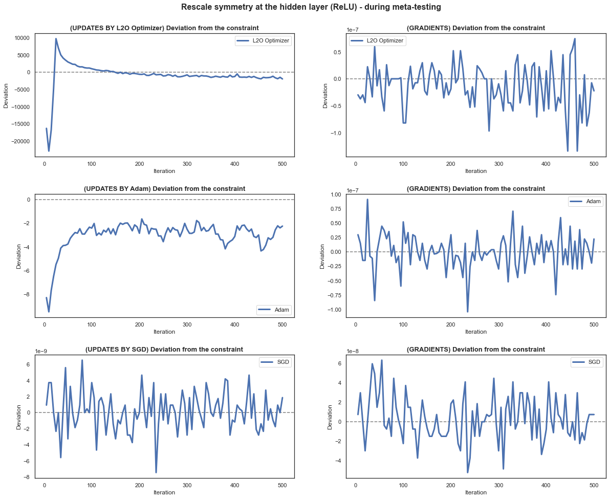
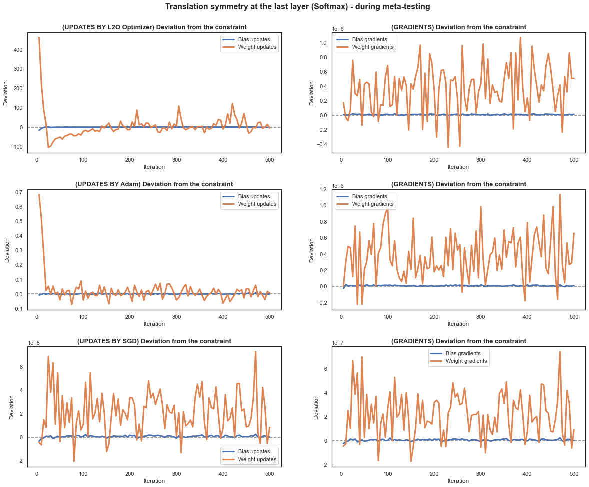

# Learning to Optimize

[Intro](#intro) - [Results](#results) - [Acknowledgements](#acknowledgements)

---

## Intro
This code is for our **study of the optimization trajectories of learned vs. traditional optimizers** from the perspective of network architecture symmetries and proposed parameter update distributions. Full paper: [Investigation into the Training Dynamics of Learned Optimizers, Jan Sobotka, Petr Šimánek, Daniel Vašata, 2023](https://johnny1188.github.io/files/2023-10-28-learning-to-optimize.pdf).


## Results
- Similarly to Lion, **learned optimizers break the geometric constraints on gradients** that stem from architectural symmetries and that deviations from these constraints are significantly larger than those observed with previous optimizers like Adam or SGD (Figure 4). In the case of learned optimizers, we observe that a large deviation from these geometric constraints almost always accompanies the initial rapid decrease in loss during optimization. More importantly, **regularizing against this symmetry breaking during meta-training severely damages performance**, hinting at the importance of this freedom in L2O parameter updates.
- In another experiment, we also see that the increasing symmetry breaking of the *Lion-SGD* optimizer (interpolation between Lion and SGD parameter updates) correlates with an increase in performance. This indicates that **breaking the strict geometric constraints might be beneficial not only for L2O but also for more traditional, manually designed optimization
algorithms**.

Figure 4: Deviations from the geometric constraints on gradients. | Figure 5: Performance after the symmetry breaking regularization. | Figure 7: Symmetry breaking and the performance of the *Lion-SGD* optimizer.
:---:|:---:|:---:
  |    |  

- Additionally, on the Figure 9 below, one can notice that the **L2O starts with the largest updates** and then slowly approaches the update distribution of Adam.
- Furthermore, by studying the noise and covariance in the L2O parameter updates, we demonstrate that, on the one hand, **L2O updates exhibit less heavy-tailed stochastic noise** (Figure 8, left; higher alpha - less heavy-tailed), and, on the other hand, **the variation in updates across different samples is larger**. This less heavy-tailed distribution of L2O updates despite the gradients exhibiting very heavy-tailed behavior, together with the high variation of updates across different samples, points to one interesting observation: **L2O appears to act as a stabilizing force in the optimization process**. While the inherent stochasticity and heavy-tailed nature of gradients might lead to erratic updates and
slow convergence, the noise clipping of L2O seems to mitigate these issues.

Figure 9: Histograms of the absolute values of parameter updates. | Figure 8: Heavy-tailedness and update covariance.
:---:|:---:
  |  

<!-- ## Usage
To install the package in an editable mode and forego any import errors, run:
```bash
pip install -e .
```

One can run both the meta-training and meta-testing in the Jupyter Notebook `scripts/main.ipynb` and then analyze the optimization runs in `scripts/analyze.ipynb`. The L2O Optimizer is implemented in `l2o/optimizer.py`, helper meta-modules are in `l2o/meta_modules.py`, and optimizee models are in `l2o/optimizee.py`. Additionally, `l2o/data.py` contains the utils for data on which optimizees are trained (MNIST).


## Results

List of available results:
- [Initial comparison](#initial-comparison)
- [Deviations from symmetry constraints](#deviations-from-symmetry-constraints)
    - [Rescale symmetry (ReLU, Leaky ReLU, Linear, etc.)](#rescale-symmetry-relu-leaky-relu-linear-etc)
    - [Translation symmetry (Softmax)](#translation-symmetry-softmax)
    - [Scale symmetry (Batch normalization)](#scale-symmetry-batch-normalization)
- [Comparison after regularizing the L2O optimizer against symmetry constraint deviations](#comparison-after-regularizing-the-l2o-optimizer-against-symmetry-constraint-deviations)

### Initial comparison
Comparisons of L2O optimizers with Adam(lr=0.03) and SGD(lr=0.1, momentum=0.9) - from left to right: Optimizee with Sigmoid, ReLU, and ReLU with Batch normalization (L2O optimizer trained for each separately). All optimizees have 1 hidden layer of 20 neurons and Softmax in the output layer. Batch normalization - affine=True, track_running_stats=False.
<p align="center">
  
  
  
</p>

### Deviations from symmetry constraints
Below are shown deviations from the geometric constraints on gradients of the loss wrt the optimizee's parameters that arise from symmetries in the network architecture. All plots are for optimizees (MLPs) with 1 hidden layer of 20 neurons (ReLU if no other is specified) and Softmax in the output layer. For the scale symmetry, additional Batch normalization is added (affine=True, track_running_stats=False) before the ReLU activation function. Theory behind it can be found in [Neural Mechanics: Symmetry and Broken Conservation Laws in Deep Learning Dynamics](https://arxiv.org/abs/2012.04728).

*Note: All plots have different scales on the y-axis.*

#### Rescale symmetry (ReLU, Leaky ReLU, Linear, etc.)




#### Translation symmetry (Softmax)




#### Scale symmetry (Batch normalization)


### Comparison after regularizing the L2O optimizer against symmetry constraint deviations

Below is shown the influence of regularizing the L2O optimizer during meta-training against deviations from the geometric constraints on gradients of the loss wrt the optimizee's parameters. In the legend of each plot, one can see the regularization strength and the target of regularization during the meta-training phase (*note: "L2O - regularize: 0.1 * constraints" in the legend means that all symmetry constraint deviations were regularized - rescale, scale, and translation*).

*Click to enlarge the plots*
<table style="padding: 10px">
    <tr>
        <th>Meta-testing optimizee architecture</th>
        <th>Meta-trained on MLP w/ 20 hidden units, sigmoid</th>
        <th>Meta-trained on MLP w/ 20 hidden units, leaky ReLU</th>
        <th>Meta-trained on MLP w/ 20 hidden units, ReLU, batch normalization</th>
    </tr>
    <tr>
        <td>
            <p>20 hidden units, sigmoid</p>
        </td>
        <td>
            
        </td>
        <td>
            
        </td>
        <td>
            
        </td>
    </tr>
    <tr>
        <td>
            <p>20 hidden units, leaky ReLU</p>
        </td>
        <td>
            
        </td>
        <td>
            
        </td>
        <td>
            
        </td>
    </tr>
    <tr>
        <td>
            <p>20 hidden units, ReLU</p>
        </td>
        <td>
            
        </td>
        <td>
            
        </td>
        <td>
            
        </td>
    </tr>
    <tr>
        <td>
            <p>20 hidden units, ReLU, batch normalization</p>
        </td>
        <td>
            
        </td>
        <td>
            
        </td>
        <td>
            
        </td>
    </tr>
    <tr>
        <td>
            <p>two layers with 20 hidden units each, sigmoid</p>
        </td>
        <td>
            
        </td>
        <td>
            
        </td>
        <td>
            
        </td>
    </tr>
    <tr>
        <td>
            <p>40 hidden units, sigmoid</p>
        </td>
        <td>
            
        </td>
        <td>
            
        </td>
        <td>
            
        </td>
</table> -->


## Acknowledgements
* Pytorch version of NIPS'16 "Learning to learn by gradient descent by gradient descent" [chenwydj/learning-to-learn-by-gradient-descent-by-gradient-descent](https://github.com/chenwydj/learning-to-learn-by-gradient-descent-by-gradient-descent).
* Original L2O code from [AdrienLE/learning_by_grad_by_grad_repro](https://github.com/AdrienLE/learning_by_grad_by_grad_repro).
* Meta modules from [danieltan07/learning-to-reweight-examples](https://github.com/danieltan07/learning-to-reweight-examples).